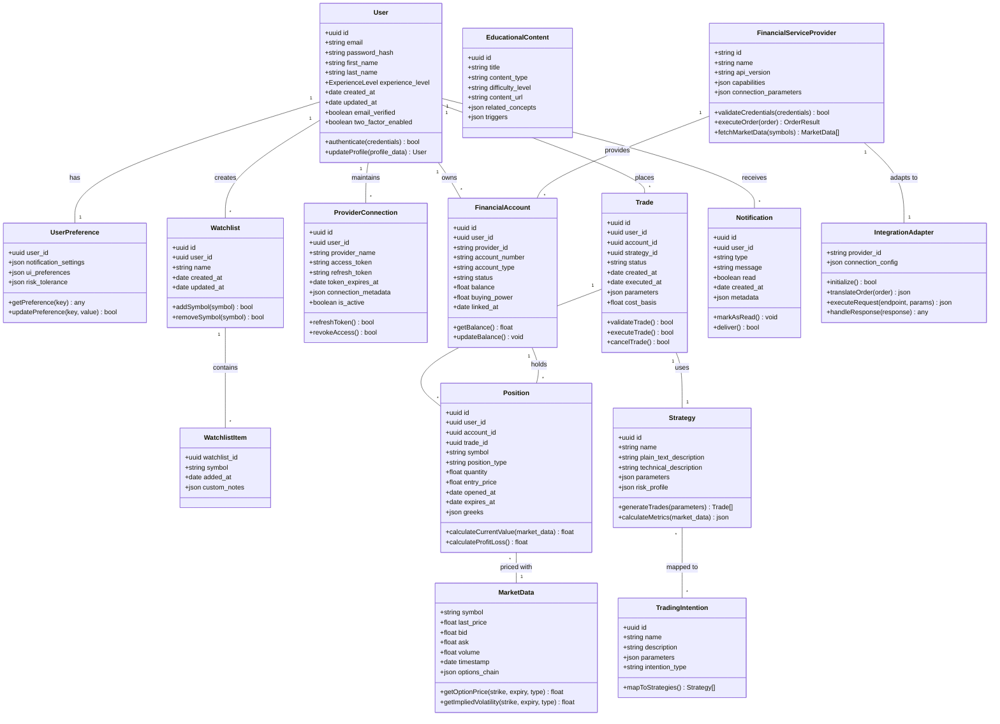
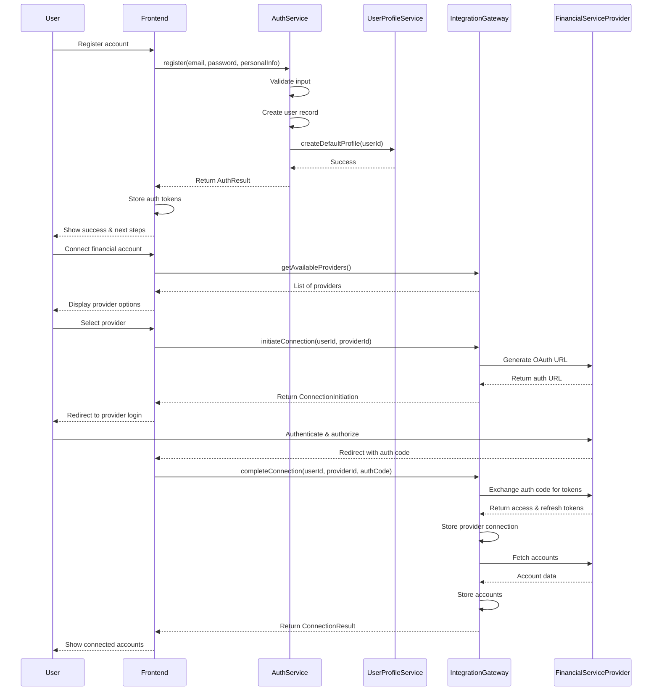
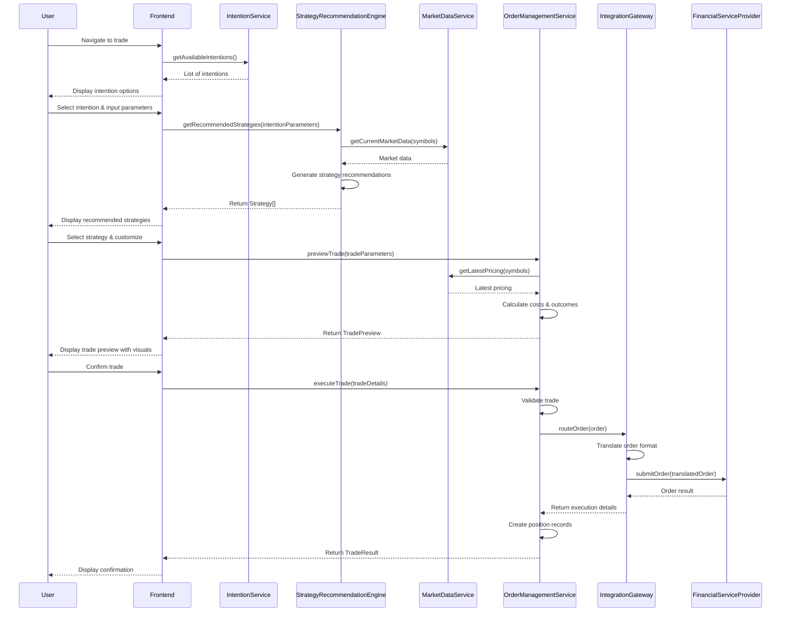
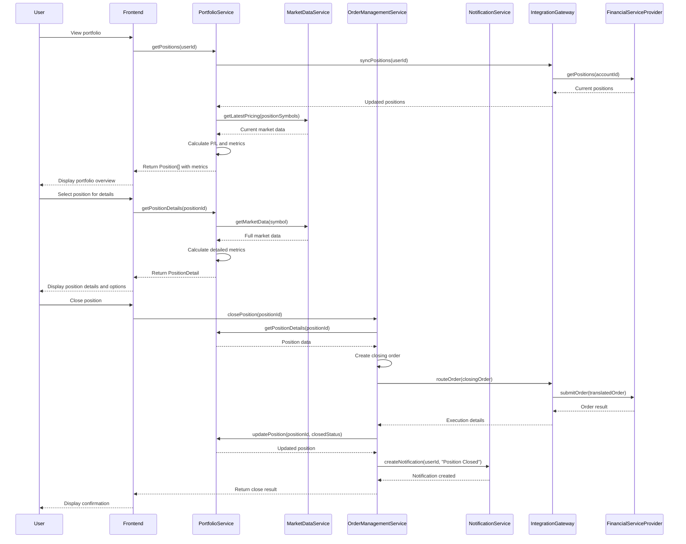
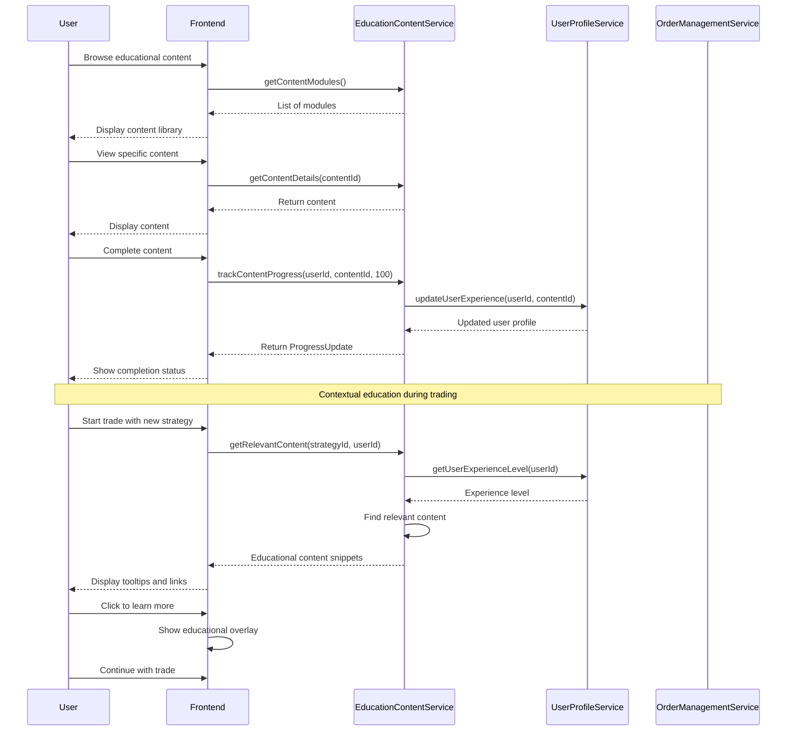
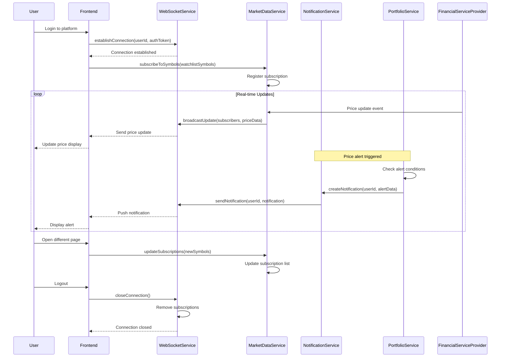

# SimpliOptions System Design

## Implementation approach

After analyzing the PRD for SimpliOptions, I've identified the key architectural components and approaches needed to build a platform that simplifies options trading through plain language while maintaining robust integration with financial service providers.

### Key Technical Challenges

1. **Plain Language Abstraction Layer**: Creating a system that translates complex options terminology into intuitive language without sacrificing accuracy
2. **Financial Services Integration**: Developing a flexible integration architecture with financial service providers
3. **Real-time Data Processing**: Handling real-time options pricing and market data efficiently
4. **User Intention Mapping**: Converting user intentions into concrete options strategies
5. **Risk Visualization**: Presenting complex risk profiles in an accessible visual format
6. **Regulatory Compliance**: Ensuring all trading activities meet financial regulations

### Technology Stack Selection

**Frontend**:
- **Framework**: React.js with TypeScript
- **UI Components**: Shadcn-ui for consistent design system
- **Styling**: Tailwind CSS for responsive design
- **State Management**: Redux Toolkit for application state
- **Data Visualization**: D3.js/Chart.js for risk and outcome visualization
- **Form Handling**: React Hook Form with Zod for validation

**Backend**:
- **Runtime**: Node.js with Express.js
- **API Design**: RESTful architecture with WebSocket support for real-time data
- **Authentication**: OAuth 2.0 implementation with JWT

**Database**:
- **Primary DB**: PostgreSQL for user data, accounts, and transactions
- **Analytics DB**: MongoDB for behavioral and analytics data
- **Caching**: Redis for market data caching and session management

**DevOps**:
- **Containerization**: Docker with Kubernetes for orchestration
- **Hosting**: AWS or GCP for scalable cloud infrastructure
- **CI/CD**: GitHub Actions for automated testing and deployment

### Open Source Libraries

1. **TradingView Lightweight Charts**: For interactive price charts
2. **Socket.io**: For real-time data updates
3. **Passport.js**: For authentication strategies
4. **Bull.js**: For background job processing and task queues
5. **Joi**: For API data validation
6. **Winston**: For logging
7. **Swagger/OpenAPI**: For API documentation

### System Architecture Overview

The SimpliOptions platform will follow a microservices architecture organized around business capabilities. This approach allows for independent scaling of different components and supports the integration of multiple financial service providers.

Key architectural components:

1. **Authentication Service**: Handles user registration, login, and session management
2. **User Profile Service**: Manages user preferences, experience levels, and settings
3. **Market Data Service**: Aggregates and normalizes data from various providers
4. **Options Translation Service**: Core service that converts between technical options terminology and plain language
5. **Strategy Recommendation Engine**: Suggests appropriate options strategies based on user intentions
6. **Order Management Service**: Handles the creation, validation, and routing of orders
7. **Integration Gateway**: Provides unified interface to multiple financial service providers
8. **Portfolio Service**: Tracks user positions, performance, and analytics
9. **Education Content Service**: Delivers contextual learning materials
10. **Notification Service**: Manages alerts and user communications

## Data structures and interfaces

The following class diagram illustrates the core data structures and their relationships within the SimpliOptions system:



### API Specifications

#### User Management API

```typescript
interface UserAuthAPI {
  register(email: string, password: string, personalInfo: UserPersonalInfo): Promise<AuthResult>;
  login(email: string, password: string): Promise<AuthResult>;
  requestPasswordReset(email: string): Promise<RequestResult>;
  resetPassword(token: string, newPassword: string): Promise<RequestResult>;
  verifyEmail(token: string): Promise<RequestResult>;
  setupTwoFactor(): Promise<TwoFactorSetupData>;
  verifyTwoFactor(code: string): Promise<RequestResult>;
  refreshToken(refreshToken: string): Promise<AuthTokens>;
  logout(): Promise<RequestResult>;
}

interface UserProfileAPI {
  getProfile(userId: string): Promise<UserProfile>;
  updateProfile(userId: string, updates: Partial<UserProfile>): Promise<UserProfile>;
  getPreferences(userId: string): Promise<UserPreferences>;
  updatePreferences(userId: string, updates: Partial<UserPreferences>): Promise<UserPreferences>;
  deleteAccount(userId: string): Promise<RequestResult>;
}
```

#### Financial Provider Integration API

```typescript
interface ProviderAPI {
  getAvailableProviders(): Promise<FinancialServiceProvider[]>;
  initiateConnection(userId: string, providerId: string): Promise<ConnectionInitiation>;
  completeConnection(userId: string, providerId: string, authCode: string): Promise<ConnectionResult>;
  listConnections(userId: string): Promise<ProviderConnection[]>;
  disconnectProvider(userId: string, connectionId: string): Promise<RequestResult>;
  refreshProviderAuth(userId: string, connectionId: string): Promise<ConnectionResult>;
}

interface AccountAPI {
  getAccounts(userId: string): Promise<FinancialAccount[]>;
  getAccountDetails(userId: string, accountId: string): Promise<FinancialAccountDetails>;
  getAccountBalance(userId: string, accountId: string): Promise<AccountBalance>;
  getAccountTransactions(userId: string, accountId: string, filters: TransactionFilters): Promise<Transaction[]>;
}
```

#### Market Data API

```typescript
interface MarketDataAPI {
  getQuote(symbol: string): Promise<Quote>;
  getOptionsChain(symbol: string): Promise<OptionsChain>;
  getHistoricalData(symbol: string, timeframe: Timeframe): Promise<CandlestickData[]>;
  searchSymbols(query: string): Promise<SymbolSearchResult[]>;
  getPopularSymbols(): Promise<Symbol[]>;
  getWatchlist(watchlistId: string): Promise<WatchlistWithData>;
}
```

#### Trading API

```typescript
interface IntentionAPI {
  getAvailableIntentions(): Promise<TradingIntention[]>;
  getIntentionDetails(intentionId: string): Promise<TradingIntentionDetail>;
  getRecommendedStrategies(intentionParameters: IntentionParameters): Promise<Strategy[]>;
}

interface TradeAPI {
  previewTrade(tradeParameters: TradeParameters): Promise<TradePreview>;
  executeTrade(tradeDetails: TradeDetails): Promise<TradeResult>;
  getTrades(userId: string, filters: TradeFilters): Promise<Trade[]>;
  getTradeDetails(tradeId: string): Promise<TradeDetailedView>;
  cancelTrade(tradeId: string): Promise<RequestResult>;
}

interface PositionAPI {
  getPositions(userId: string, accountId?: string): Promise<Position[]>;
  getPositionDetails(positionId: string): Promise<PositionDetail>;
  calculatePositionMetrics(positionId: string): Promise<PositionMetrics>;
  closePosition(positionId: string): Promise<TradeResult>;
  rollPosition(positionId: string, newParameters: RollParameters): Promise<TradePreview>;
}
```

#### Education API

```typescript
interface EducationAPI {
  getContentModules(): Promise<EducationalModule[]>;
  getContentDetails(contentId: string): Promise<EducationalContent>;
  getRecommendedContent(userId: string): Promise<EducationalContent[]>;
  trackContentProgress(userId: string, contentId: string, progress: number): Promise<ProgressUpdate>;
  getGlossary(term?: string): Promise<GlossaryTerm[]>;
}
```

#### Notification API

```typescript
interface NotificationAPI {
  getNotifications(userId: string): Promise<Notification[]>;
  markAsRead(notificationId: string): Promise<RequestResult>;
  markAllAsRead(userId: string): Promise<RequestResult>;
  updateNotificationPreferences(userId: string, preferences: NotificationPreferences): Promise<NotificationPreferences>;
}
```

## Program call flow

The following sequence diagrams illustrate key flows within the SimpliOptions system:

### User Onboarding and Account Connection



### Intention-Based Trading Flow



### Portfolio Monitoring and Position Management



### Educational Content Integration



### Real-time Market Data and Notifications



## Anything UNCLEAR

1. **Provider Integration Details**: The specific financial service providers (brokers, exchanges) to integrate with aren't specified. Different providers have varying APIs, capabilities, and regulatory requirements which could impact the implementation details.

2. **Regulatory Requirements**: The PRD doesn't specify which markets/countries the platform will operate in, which has significant regulatory implications. Different jurisdictions have different requirements for options trading platforms.

3. **Revenue Model**: The business model isn't clearly specified. Will the platform charge commissions, subscription fees, or use another revenue model? This could affect the architecture decisions.

4. **Data Storage Requirements**: The PRD doesn't specify data retention policies, especially for sensitive financial information and transaction history. This impacts database design and compliance measures.

5. **Options Trading Levels**: Options trading typically requires different approval levels based on user experience and account size. The PRD doesn't detail how these permissions will be managed or enforced.

6. **Scale Expectations**: Initial user base size and growth expectations aren't specified, which affects infrastructure choices and scaling strategies.

7. **Localization Requirements**: Will the platform need to support multiple languages and currencies for international users?

8. **Mobile Strategy Details**: While mobile responsiveness is mentioned, it's unclear if native mobile apps are planned for Phase 1 or will remain as future enhancements.

These uncertainties should be clarified with stakeholders before finalizing the architecture and beginning implementation.