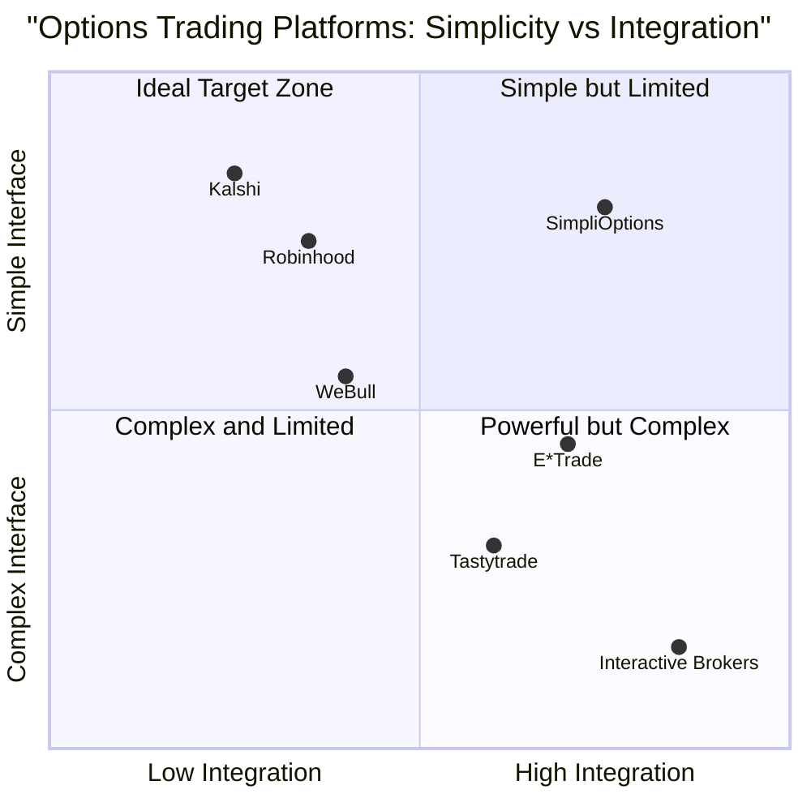

# Product Requirements Document: SimpliOptions

## Language & Project Info
- **Language**: English
- **Programming Language**: Shadcn-ui, TypeScript, and Tailwind CSS
- **Project Name**: simpli_options

### Original Requirements
Create a platform that has a simple UI/UX and allows the casual retail trader to trade options. Options are normally very difficult to trade because they use confusing language and are hard to understand. The platform should use plain language describing what exactly the trader is betting on. It should be better integrated with a financial services provider than existing platforms like Kalshi.

## Product Definition

### Product Goals
1. **Simplify options trading** by replacing complex jargon with intuitive, plain language descriptions accessible to casual retail investors
2. **Reduce trading barriers** through streamlined onboarding, education, and decision-making processes
3. **Enable seamless integration** with financial service providers for reliable execution, portfolio management, and regulatory compliance

### User Stories
1. As a novice investor, I want to understand exactly what I'm betting on when trading options, so that I can make informed decisions without having to learn complex industry jargon.
2. As a casual retail trader, I want a simplified options trading interface, so that I can execute trades quickly and confidently without feeling overwhelmed.
3. As an investor who occasionally trades options, I want integrated educational content presented alongside trading opportunities, so that I can learn while trading.
4. As a retail investor, I want my options trading platform to integrate with my existing financial accounts, so that I can manage my entire portfolio in one place.
5. As a mobile user, I want to be able to trade options easily on my smartphone, so that I can make trades anywhere, anytime.

### Competitive Analysis

#### 1. Robinhood
**Pros**:
- Clean, minimalist interface appealing to new traders
- Commission-free options trading
- Simple mobile-first design

**Cons**:
- Limited educational resources
- Basic options strategies only
- Oversimplification can obscure risks
- Limited customer support

#### 2. Tastytrade
**Pros**:
- Purpose-built for options traders
- Extensive educational content
- Capped commission structure
- Advanced metrics and analytics

**Cons**:
- Interface can be overwhelming for beginners
- Learning curve remains steep
- Terminology remains complex and technical

#### 3. WeBull
**Pros**:
- Competitive fee structure
- Strong mobile interface
- Good intermediate analysis tools

**Cons**:
- Technical language throughout
- Educational content less structured
- Limited options-specific tools for beginners

#### 4. Kalshi
**Pros**:
- Plain language event contracts
- Binary outcomes simplify decision making
- Clear visualization of probabilities

**Cons**:
- Limited to event contracts, not traditional options
- Limited integration with broader financial accounts
- Less familiar to traditional investors

#### 5. Interactive Brokers
**Pros**:
- Professional-grade tools
- Highly reliable execution
- Comprehensive options capabilities

**Cons**:
- Extremely complex interface
- Intimidating for casual traders
- Steep learning curve

#### 6. E*Trade
**Pros**:
- Solid options education resources
- Good balance of features and usability
- Integrated banking features

**Cons**:
- Traditional terminology throughout
- Higher per-contract fees
- Interface still complex for beginners

### Competitive Quadrant Chart

## Technical Specifications

### Requirements Analysis
The SimpliOptions platform must address the critical pain points preventing casual retail traders from confidently trading options. Traditional options platforms feature complex terminology, overwhelming interfaces, and inadequate educational resources. Our platform needs to reframe options trading with intuitive language, streamlined decision flows, and contextual learning while maintaining deep integration with financial service providers for proper execution and portfolio management.

The key technical challenges include:
1. Translating complex options terminology into intuitive, plain language without sacrificing accuracy
2. Creating a decision-making framework that guides users to appropriate trading strategies based on their market outlook
3. Developing robust API integrations with financial service providers for account management, trade execution, and regulatory compliance
4. Balancing simplicity with adequate risk disclosure and educational content
5. Building a responsive design that works seamlessly across devices

### Requirements Pool

#### P0 (Must-Have)
1. Plain language conversion of options trading terminology throughout the platform
2. Intention-based trade selection (e.g., "I think Stock X will rise by date Y" instead of "Buy call option")
3. Visual representation of potential outcomes and risk exposure
4. Core options strategies with simplified explanations (calls, puts, covered calls, protective puts)
5. Integration with at least one major financial services provider API for trade execution
6. Strong onboarding process with basic options education
7. Clear display of fees, break-even points, and maximum loss scenarios
8. Mobile-responsive design with core functionality
9. Real-time data for options pricing
10. Account management and basic portfolio view

#### P1 (Should-Have)
1. Interactive tutorials and guided first-trade experience
2. Scenario-based learning modules integrated into the trading flow
3. Personalized dashboard with watchlists and followed strategies
4. Expanded options strategies with plain language explanations
5. Integration with multiple financial service providers
6. Basic paper trading functionality for practice
7. Social features to see popular trades (anonymized)
8. Notification system for price alerts and trade updates
9. Advanced filtering of opportunities based on user preferences
10. Historical performance tracking of user's trading strategies

#### P2 (Nice-to-Have)
1. AI-powered strategy suggestions based on market outlook
2. Advanced options chain visualization with plain language tooltips
3. Community features including discussion forums with moderation
4. Integration with tax preparation services
5. Custom strategy builder with risk assessment
6. Automated rolling of options positions
7. Market sentiment analysis in plain language
8. Portfolio stress testing and scenario analysis
9. Enhanced educational content including video lessons and webinars
10. API access for advanced users to build their own tools

### UI Design Draft

#### Homepage/Dashboard
- Clean, minimal interface with clear navigation
- Personalized watchlist with plain language market summaries
- Quick access to popular trading intentions (e.g., "Profit if stock rises", "Protect my holdings")
- Account summary with simplified P/L display
- Educational prompts based on user experience level

#### Trade Creation Flow
1. **Intention Selection**:
   - "What do you think will happen?" (Rise, Fall, Stay Flat, Uncertain)
   - "When do you think this will happen?" (Timeline selection)
   - "How confident are you?" (Risk tolerance indicator)

2. **Strategy Suggestion**:
   - Based on user's indicated market outlook, present appropriate strategies in plain language
   - Visual comparison of suggested strategies with key metrics

3. **Strategy Customization**:
   - Simple sliders and toggles to adjust key parameters
   - Real-time updates of cost, potential profit/loss, and break-even points
   - Plain language explanations of what each adjustment means

4. **Review & Execute**:
   - Clear summary of the trade in plain language
   - Visualization of potential outcomes
   - Transparent fee disclosure
   - One-tap execution with confirmation

#### Learning Integration
- Contextual tooltips and explanations
- "Learn More" expandable sections within trading flows
- Achievement system for completing educational modules
- Glossary with side-by-side technical and plain language terms

#### Mobile Considerations
- Bottom navigation for core functions
- Simplified data displays optimized for small screens
- Touch-friendly controls for trade adjustments
- Swipe gestures for common actions

### Open Questions
1. What specific financial service providers should be prioritized for initial integration?
2. How much risk disclosure is legally required in the simplified interface?
3. Should we offer advanced features for users who "graduate" beyond the basics?
4. What metrics should we track to measure if users are making more informed decisions?
5. How do we balance simplification with ensuring users understand the inherent risks of options trading?
6. Should paper trading be implemented before or after the core trading functionality?
7. How do we approach approval for different levels of options trading access?
8. What regulatory considerations need to be addressed for different markets (US, Europe, etc.)?

## Implementation Considerations

### Technical Stack
- **Frontend**: React.js with TypeScript and Tailwind CSS using Shadcn-ui components
- **Backend**: Node.js with Express or Nest.js
- **Database**: PostgreSQL for user data and MongoDB for analytical data
- **APIs**: RESTful API architecture with GraphQL consideration for data-intensive operations
- **Hosting**: AWS or Google Cloud Platform with containerization using Docker

### Integration Architecture
- OAuth 2.0 for authentication with financial service providers
- Webhook system for real-time updates on trades and market events
- Caching layer for frequently accessed market data
- Message queue system for handling asynchronous processes like trade execution

### Security Considerations
- Two-factor authentication for all user accounts
- Encryption for all sensitive user data
- Compliance with financial regulations including KYC requirements
- Regular security audits and penetration testing
- Secure API keys management for financial service provider integrations

### Development Phases

#### Phase 1 (MVP)
- Core platform with basic options trading functionality
- Integration with one major financial service provider
- Fundamental educational content
- Mobile-responsive web application

#### Phase 2 (Enhancement)
- Additional financial service provider integrations
- Expanded strategy offerings
- Advanced educational content
- Community features and social elements

#### Phase 3 (Expansion)
- Native mobile applications
- Advanced analytics and performance tracking
- AI-powered recommendations
- Additional asset classes with simplified interfaces

## Success Metrics

### User Engagement
- Active users (daily, weekly, monthly)
- Average session duration
- Completion rate of educational modules
- Retention rates after first trade

### Trading Activity
- Number of trades per user
- Diversity of strategies employed
- Time from account creation to first trade
- Percentage of users progressing from simple to more complex strategies

### Business Metrics
- User acquisition cost
- Revenue per user
- Conversion rate from free to premium features (if applicable)
- Partnership revenue from financial service providers

### User Satisfaction
- Net Promoter Score
- User satisfaction surveys
- App store ratings
- Feature request engagement

## Conclusion
The SimpliOptions platform aims to revolutionize options trading for casual retail investors by removing the complexity and jargon that typically serves as a barrier to entry. By focusing on intuitive language, guided decision flows, and seamless integration with financial service providers, we can create a platform that makes options trading accessible while still providing the necessary tools for informed decision-making. The project will require careful balance between simplification and adequate disclosure, but has the potential to open options trading to a significant untapped market of retail investors.